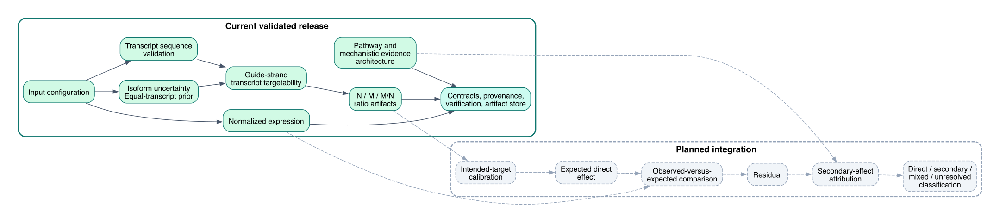

# siRNA Off-Target Analysis Harness

A reproducible weight-of-evidence framework for distinguishing direct siRNA off-target effects from downstream secondary expression changes.

This project is a weight-of-evidence framework for distinguishing direct siRNA
off-target effects from downstream secondary expression changes by integrating:

- normalized transcriptomic changes
- sequence-based transcript targetability
- isoform uncertainty
- pathway and mechanistic evidence

siRNA treatment can produce expression changes through direct transcript
targeting. Expression changes can also occur indirectly through pathway,
regulatory, or stress-response effects. Transcript isoform structure complicates
direct-target interpretation because a guide may target one transcript but not
another. This harness separates and preserves these evidence types instead of
collapsing them into one score. The current validated release establishes normalized expression processing, isoform-aware transcript eligibility, sequence-based transcript targetability, formal N/M/M/N estimation, pathway evidence architecture, provenance, and independent verification.
Intended-target calibration, expected direct effect, residual attribution,
secondary-effect integration, and final classification remain planned.



## Implemented and Validated

- pathway and mechanistic evidence architecture
- normalized expression processing
- isoform uncertainty
- equal-transcript prior
- transcript sequence snapshot validation
- guide-strand targetability
- exact and cleavage-compatible site evidence
- seed-only evidence preservation
- missing-sequence and failed-gene handling
- formal N
- formal M
- formal M/N
- typed contracts
- provenance
- checksums
- resume
- independent verification
- testing and release gates

## Planned, Not Yet Implemented

- intended-target calibration
- expected direct effect
- residual calculation
- secondary-effect attribution
- multi-source evidence integration
- final direct / secondary / mixed classification

## Current vs Planned

| Component | Status | Purpose |
| --- | --- | --- |
| Expression normalization | Implemented | Establish comparable gene-expression changes |
| Isoform uncertainty | Implemented | Define eligible transcript set and equal prior |
| Transcript targetability | Implemented | Identify sequence-compatible direct targets |
| N/M/M/N | Implemented | Estimate targetable transcript fraction |
| Pathway evidence architecture | Implemented | Preserve mechanistic relationships |
| Intended-target calibration | Planned | Estimate effective knockdown |
| Expected direct effect | Planned | Predict direct expression decrease |
| Residual attribution | Planned | Identify unexplained expression change |
| Final classification | Planned | Direct, secondary, mixed, or unresolved |

## How the Current Analysis Works

1. Normalized gene-expression changes are loaded.
2. Relevant transcripts are defined from committed annotation evidence.
3. Each transcript is checked for sequence-based siRNA targetability.
4. N is the number of eligible transcripts.
5. M is the number of unique cleavage-compatible targetable transcripts.
6. M/N is the equal-prior fraction of targetable transcripts.
7. Seed-only evidence is preserved separately.
8. Missing sequence is not converted to non-targetable.
9. Pathway evidence is preserved for later secondary-effect interpretation.

Small example: a gene has 4 eligible transcripts. One transcript has verified
cleavage-compatible evidence, 2 transcripts have seed-only evidence, and 1
transcript has no supported site.

- N = 4
- M = 1
- M/N = 0.25
- seed-only transcript count = 2

Seed-only evidence is not included in default M because it may represent
miRNA-like recognition rather than cleavage-compatible direct targeting.

## Quick Start

```bash
python -m venv .venv
source .venv/bin/activate
python -m pip install -e ".[dev]"

sirna-offtarget run \
  --config examples/portfolio/config.yaml \
  --until-stage transcript_targetability_ratio
```

This executes exactly these official current stages:

`validate`, `prepare_inputs`, `map_identifiers`, `sequence_analysis`,
`expression_analysis`, `isoform_uncertainty`, `transcript_targetability`,
`transcript_targetability_ratio`.

Running without `--until-stage` stops at the same current terminal stage:
`transcript_targetability_ratio`.

Outputs are written to `examples/portfolio/output/`. Open this ratio table first:

`examples/portfolio/output/stages/08_transcript_targetability_ratio/attempts/attempt_001/committed/outputs/gene_transcript_targetability_ratios_v1.tsv`

Inspect N, M, and M/N in `n_total_eligible_transcripts`,
`m_targetable_transcripts`, and `ratio_m_over_n`. Seed-only evidence is in
`seed_only_transcript_ids` and `seed_only_transcript_count`. Unresolved
transcripts are listed in
`transcript_targetability_ratio_unresolved_v1.tsv`.

The curated portfolio summary table is:

[examples/portfolio/portfolio_result_summary.md](examples/portfolio/portfolio_result_summary.md)

## Portfolio Example Result

| Gene | Eligible transcripts N | Cleavage-compatible transcripts M | M/N | Exact-match transcripts | Seed-only transcripts | Unresolved transcripts | Sequence status | Ratio status | Evidence interpretation |
| --- | ---: | ---: | ---: | ---: | ---: | ---: | --- | --- | --- |
| FULL_TARGET | 1 | 1 | 1.0 | 1 | 1 | 0 | available | definitive | all eligible transcripts contain cleavage-compatible evidence |
| NON_TARGETABLE | 1 | 0 | 0.0 | 0 | 0 | 0 | available | definitive | no cleavage-compatible evidence was identified |
| PARTIAL_MULTI | 3 | 1 | 0.3333333333333333 | 1 | 2 | 0 | available | definitive | a subset of eligible transcripts contains cleavage-compatible evidence |
| SEED_ONLY | 2 | 0 | 0.0 | 0 | 2 | 0 | available | definitive | seed-only evidence was preserved separately |
| SEQUENCE_MISSING | 1 |  |  | 0 | 0 | 1 | unavailable | unavailable_incomplete_evidence | ratio unavailable because transcript sequence was unavailable |

## Why This Project Matters

This project demonstrates mechanistic bioinformatics reasoning, transcriptomics
interpretation, sequence-based targetability analysis, isoform-aware uncertainty
handling, pathway-informed evidence architecture, reproducible workflow
engineering, typed scientific contracts, provenance, independent verification,
and test-driven development.

## Quality Summary

Post-cleanup release evidence reports:

- full suite: 528 passed
- portfolio tests: 35 portfolio tests passed
- focused scientific tests: 305 passed
- line coverage: 0.9482
- branch coverage: 0.8502
- lint result: passed
- formatting result: passed
- typing result: passed
- import-boundary result: passed
- build result: passed
- clean-install result: passed
- post-package verification result: passed

## Release Integrity

Release integrity is verified with two complementary checks. The repository
records an internal source-tree SHA-256 and source inventory count, while the
final ZIP archive is verified externally with the adjacent `.zip.sha256`
sidecar file. The ZIP does not embed its own final checksum because editing the
archive to insert that checksum would change the checksum itself.

## Current Limitations

- current release does not yet calculate expected direct effect
- current release does not yet attribute residual expression change
- current release does not yet classify direct, secondary, or mixed effects
- no production-scale biological benchmark has yet been completed
- equal-transcript prior is a deliberate default under short-read isoform uncertainty
- seed-only evidence is preserved but excluded from default cleavage-compatible M
- passenger-strand analysis is not currently supported
- bulge/indel alignment is not currently supported
- pathway architecture exists, but final integration is planned

## Repository Structure

```text
src/                         Python package
tests/                       Unit, integration, regression, architecture, portfolio tests
docs/                        Scientific and portfolio documentation
examples/portfolio/          Public deterministic portfolio example
scripts/                     Release and verification helpers
README.md                    Repository landing page
LATEST.md                    Current release status
release_manifest.json        Machine-readable release evidence
```

## Documentation

- [Portfolio overview](docs/portfolio_overview.md)
- [Biological problem](docs/biological_problem.md)
- [Current vs planned](docs/current_vs_planned.md)
- [How to read results](docs/how_to_read_results.md)
- [Portfolio example walkthrough](docs/portfolio_example_walkthrough.md)
- [Architecture: current and planned](docs/architecture_current_and_planned.md)
- [Public release limitations](docs/public_release_limitations.md)

## Citation and Attribution

This is an independently written synthetic-data portfolio repository. If you
reuse the workflow or documentation, cite the repository name and release
manifest checksum for the version you used.
