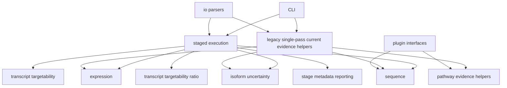

# Architecture

`sirna_offtarget` uses a layered architecture so scientific calculations stay
independently testable and reporting remains presentation-only.

## Responsibilities

- `cli`: parses options, emits structured status, delegates to staged execution.
- `application`: coordinates current evidence helper APIs only.
- `io`: parses local files and serializes outputs; no scientific inference.
- `sequence`: reverse-complement siRNA matching, mismatch, seed, and site features.
- `expression`: normalization, fold-change, shrinkage, replicate consistency, low-count flags.
- `isoform_uncertainty`: transcript-set policy, equal prior, and final artifact verification.
- `transcript_targetability`: guide-strand transcript sequence evidence.
- `transcript_targetability_ratio`: formal N, M, and M/N verification.
- `pathway`: evidence architecture and provider normalization for planned integration.
- `reporting`: staged run metadata, artifact catalogs, and provenance helpers.
- `plugins`: abstract interfaces for optional third-party engines.

## Forbidden Imports

Scientific modules must not import `sirna_offtarget.cli` or
`sirna_offtarget.reporting`. `sequence` must not import expression or pathway
implementations. Reporting must not import alignment, expression, isoform, or
pathway implementations to drive scientific inference.

## Public API Conventions

Cross-package imports should use each package's `api.py` or `__init__.py`.
Private implementation modules are intended for local package use and direct
unit tests only.

## Adding A Module Safely

1. Add calculations in the relevant domain package.
2. Expose only the minimal function through `api.py`.
3. Keep thresholds in `config.py` or a package `policies.py`.
4. Add unit tests and architecture tests if new dependencies are introduced.
5. Do not create files, network calls, or run analysis at import time.

## Validation Boundary

Synthetic fixtures validate calculations, deterministic behavior, output
schemas, and current evidence contracts. External experimentally confirmed
datasets are required for biological calibration and validation.
