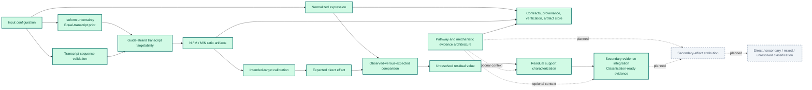

# Architecture: Current and Planned

Solid green nodes are implemented and validated in the current release. Dashed
gray nodes are planned integration work.

```mermaid
flowchart LR
  classDef done fill:#d1fae5,stroke:#0f766e,stroke-width:2px,color:#064e3b
  classDef planned fill:#f1f5f9,stroke:#94a3b8,stroke-width:2px,stroke-dasharray: 6 4,color:#475569

  cfg["Input configuration"]:::done
  expr["Normalized expression"]:::done
  iso["Isoform uncertainty<br/>Equal-transcript prior"]:::done
  seq["Transcript sequence validation"]:::done
  targ["Guide-strand transcript targetability"]:::done
  ratio["N / M / M/N ratio artifacts"]:::done
  path["Pathway and mechanistic evidence architecture"]:::done
  store["Contracts, provenance, verification, artifact store"]:::done

  cal["Intended-target calibration"]:::done
  exp["Expected direct effect"]:::done
  comp["Observed-versus-expected comparison"]:::done
  res["Unresolved residual value"]:::done
  support["Residual support characterization"]:::done
  secint["Secondary evidence integration<br/>Classification-ready evidence"]:::done
  sec["Secondary-effect attribution"]:::planned
  cls["Direct / secondary / mixed / unresolved classification"]:::planned

  cfg --> expr
  cfg --> iso
  cfg --> seq
  expr --> store
  iso --> targ
  seq --> targ
  targ --> ratio
  ratio --> store
  path --> store
  expr --> comp
  ratio --> cal
  cal --> exp
  exp --> comp
  comp --> res
  res --> support
  path -. optional context .-> support
  support --> secint
  path -. optional context .-> secint
  path -. planned .-> sec
  secint -. planned .-> sec
  sec -. planned .-> cls
```
